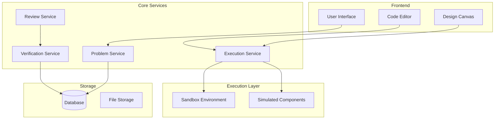

# Writeup for ReelCode

Motivation : A real world problem solving platform where people can collaborate and solve system design, LLD , HLD problems.
Rough Draft :

I want to create a problem solving platform where real world problems can be solved, the problems are related to software development. For this I want following features in my platform :

1. Real world problems statements. Refer following links
   1. donnemartin/system-design-primer: Learn how to design large-scale systems. Prep for the system design interview. Includes Anki flashcards. (github.com)
   2.

[https://app.codecrafters.io](https://app.codecrafters.io/)

3.

[https://github.com/codewithayaann/Machine-Round-Challenge](https://github.com/codewithayaann/Machine-Round-Challenge)

2. Each of these problems should be further divided into layers of concepts and user should be supplying solution in increasing level of difficulty. For example
   1. Problem Statement : Design a url shortening system, a URL shortener will take url as input and shortened url as output. the system should generate unique shortened urls (surl) for each URL supplied, the system can hold these url for 10 years. for every url the surl should be generated same.
      1. now we have to give above problem statement to user so that they can design a basic code that represents above system, and our platform will add up difficulty level by adding conditions so that we can represent a real world problem.
      2. Testing: each of these codes will be tested and we can also use AI to judge whether our code fulfils the criteria or not.
   2. Solution : the solution will be supplied by the user on our sandbox, our sandbox should be able to support multiple languages, frameworks etc.
3. since we will be continuously improving and adding new languages/ frameworks so the system has to be highly modular.

Also :

1. For user solution I want you to support both LC and system design discussions. Our main focus is that not only user learns and practice solving these real-world problems but also one can assess themselves.
2. Testing :
   1. our system first will support peer review and when we have enough data to go around, we will then implement AI to learn on that data & give feedback as well. These sections will be separated.
   2. Our system will judge the submission on the basis of following parameters:
      1. How close is the solution from the actual problem statement, does the solution addresses the problem or not ? We can put parameters for passing the test, for example , if the classes and functions represent the flow of the problem ? if the implementation actually solves the problem.
      2. code quality, performance, design patterns are also a criteria.
      3. Since we are developing a very subjective application so the user must be able to provide justification for every assessment. So that our system can learn. An expert will then verify the both system's feedback and user's feedback and pass a final judgement on correctness of the assessment. This feedback will be used for training the AI in future.
   3. Early release sandbox environment
      our system will support most popular environments first like 1. java 2. js/nodejs 3. python 4. sql / mysql for database
      thereafter we will add more features like server, serverless, load balancers, and these will be like placeholders we dont have to implement an actual load balancer, just something that can mimic such modules.

========================================================

I used [claude.ai](http://claude.ai) to create diagrams , and more grammatically corrected and organized version as follows.

# Problem Solving Platform - Technical Documentation

## Overview

The Problem Solving Platform is designed to provide a comprehensive environment for practicing and learning real-world software development problems. The platform focuses on both practical implementation and system design aspects, allowing users to progressively learn and assess their skills through hands-on experience with increasing complexity levels.

## Core Philosophy

The platform is built on three fundamental principles:

1. Real-world problem-solving through practical implementation
2. Progressive learning through incremental complexity
3. Comprehensive peer review and verification system

## System Components

### 1. Problem Repository

### 1.1 Problem Categories

- **Implementation Problems**: Focused on coding solutions
- **System Design Problems**: Architectural and design-focused challenges
- **Hybrid Problems**: Combining both implementation and design aspects

### 1.2 Problem Structure

Each problem is structured in progressive levels:

```json
{
  "problemId": "unique_identifier",
  "title": "Problem Title",
  "baseDescription": "Initial problem statement",
  "levels": [
    {
      "level": 1,
      "description": "Basic implementation requirements",
      "constraints": [],
      "concepts": ["basic_concept_1", "basic_concept_2"]
    },
    {
      "level": 2,
      "description": "Enhanced requirements",
      "constraints": ["constraint_1", "constraint_2"],
      "concepts": ["advanced_concept_1"]
    }
    // Additional levels with increasing complexity
  ]
}
```

Example Problem:

```
Base Problem: URL Shortening System
Level 1: Basic URL shortening with in-memory storage
Level 2: Add persistent storage and duplicate URL handling
Level 3: Implement caching and basic load handling
Level 4: Add analytics and URL expiration
Level 5: Scale the system with load balancers and distributed storage

```

### 2. Execution Environment

### 2.1 Initial Supported Environments

1. **Java**
   - Runtime: JDK 17+
   - Build Tools: Maven/Gradle
   - Testing Framework: JUnit
2. **JavaScript/Node.js**
   - Runtime: Node.js 18+
   - Package Manager: npm
   - Testing Framework: Jest
3. **Python**
   - Runtime: Python 3.9+
   - Package Manager: pip
   - Testing Framework: pytest
4. **SQL/MySQL**
   - Engine: MySQL 8.0
   - Support for DDL and DML operations
   - Query execution and optimization testing

### 2.2 Simulated Components

The platform provides simulated versions of common infrastructure components:

- Load Balancers
- Caching Systems
- Service Discovery
- Message Queues
- Distributed Storage Systems

These components mimic real-world behavior without actual implementation.

### 3. Assessment System

### 3.1 Evaluation Parameters

1. **Problem-Solution Alignment**
   - Correctness of implementation
   - Adherence to requirements
   - Functional completeness
2. **Technical Quality**
   - Code quality and organization
   - Performance optimization
   - Design pattern implementation
   - System architecture (for design problems)
3. **Implementation Quality**
   - Class and function structure
   - Code maintainability
   - Error handling
   - Documentation

### 3.2 Review Process

The platform implements a multi-stage review process:

1. **Peer Review Stage**

```json
{
  "reviewType": "peer",
  "aspects": [
    {
      "category": "solution_correctness",
      "score": "1-10",
      "justification": "required",
      "evidenceReferences": "required"
    },
    {
      "category": "code_quality",
      "score": "1-10",
      "justification": "required",
      "codeReferences": "required"
    }
  ]
}
```

1. **Expert Verification Stage**

```json
{
  "verificationType": "expert",
  "reviewAssessment": {
    "accuracy": "1-10",
    "completeness": "1-10",
    "fairness": "1-10"
  },
  "feedback": {
    "corrections": [],
    "annotations": [],
    "trainingData": []
  }
}
```

1. **AI Integration (Future Phase)**

- Learning from verified peer reviews
- Pattern recognition from expert assessments
- Automated feedback generation

### 3.3 Feedback System

Each review must include:

- Specific justification for assessments
- Code or design references
- Improvement suggestions
- Learning resources

### 4. Progressive Learning System

### 4.1 Concept Mapping

```json
{
  "concept": "distributed_systems",
  "prerequisites": ["networking_basics", "database_fundamentals"],
  "progressionPath": [
    "basic_architecture",
    "data_partitioning",
    "replication",
    "consistency_patterns"
  ]
}
```

### 4.2 Level Progression

Each level introduces:

- New technical concepts
- Additional constraints
- Enhanced requirements
- Performance considerations

### 5. System Architecture



### 6. Future Enhancements

### 6.1 AI Integration

- Learning from peer review data
- Automated code review
- Performance optimization suggestions
- Design pattern recommendations

### 6.2 Additional Environments

- Additional programming languages
- Cloud service integrations
- Container orchestration
- Serverless computing

## Implementation Guidelines

### 1. Module Development

- Follow microservices architecture
- Implement clear service boundaries
- Design for extensibility
- Maintain comprehensive test coverage

### 2. Quality Assurance

- Automated testing pipeline
- Performance benchmarking
- Security scanning
- Code quality metrics

### 3. Deployment Strategy

- Containerized services
- Infrastructure as Code
- Automated deployment pipeline
- Monitoring and logging

## Security Considerations

### 1. Code Execution

- Isolated sandbox environments
- Resource usage limits
- Network access restrictions
- Execution timeouts

### 2. User Data

- Encrypted storage
- Access control
- Audit logging
- GDPR compliance

## Maintenance and Support

### 1. Platform Updates

- Regular environment updates
- New problem additions
- Framework updates
- Security patches

### 2. Community Support

- Documentation maintenance
- User feedback system
- Problem suggestion system
- Community contributions

# Problem Structure and Progression System

## 1. Problem Organization

### 1.1 Problem Categories

Problems are organized into three main categories:

1. **Implementation Problems**
   - Focus on coding and implementation
   - Emphasize algorithmic thinking and code organization
   - Include performance and scalability considerations
2. **System Design Problems**
   - Focus on architectural decisions
   - Cover distributed systems concepts
   - Include scalability and reliability patterns
3. **Hybrid Problems**
   - Combine implementation and design aspects
   - Require both coding and architectural solutions
   - Focus on end-to-end system development

### 1.2 Core Problem Components

```json
{
  "problemId": "string",
  "category": "IMPLEMENTATION | SYSTEM_DESIGN | HYBRID",
  "title": "string",
  "difficulty": {
    "baseLevel": "BEGINNER | INTERMEDIATE | ADVANCED",
    "complexityScore": "number (1-10)"
  },
  "concepts": [
    {
      "id": "string",
      "name": "string",
      "category": "string",
      "prerequisites": ["concept_ids"]
    }
  ],
  "progressionLevels": ["level_ids"],
  "resources": {
    "documentation": ["urls"],
    "references": ["urls"],
    "examples": ["code_snippets"]
  }
}
```

## 2. Progression System

### 2.1 Level Structure

Each problem is divided into multiple levels of increasing complexity:

```json
{
  "levelId": "string",
  "orderNumber": "number",
  "requirements": {
    "functional": ["list_of_requirements"],
    "nonFunctional": ["list_of_requirements"]
  },
  "constraints": ["list_of_constraints"],
  "concepts": ["list_of_concepts"],
  "testCriteria": {
    "functionalTests": ["test_ids"],
    "performanceTests": ["test_ids"],
    "designCriteria": ["criteria_ids"]
  }
}
```

### 2.2 Example Problem Progression

Let's take a real-world example of "Design a URL Shortening Service":

### Level 1: Basic Implementation

```json
{
  "levelId": "url_shortener_l1",
  "description": "Basic URL Shortening Service",
  "requirements": {
    "functional": [
      "Convert long URL to short URL",
      "Redirect short URL to original URL",
      "Basic error handling"
    ],
    "nonFunctional": ["Response time < 100ms", "Handle concurrent requests"]
  },
  "constraints": ["In-memory storage", "Single server setup"],
  "concepts": ["hashing", "data_structures", "basic_http"]
}
```

### Level 2: Persistent Storage

```json
{
  "levelId": "url_shortener_l2",
  "requirements": {
    "functional": [
      "Persistent storage of URLs",
      "Duplicate URL handling",
      "URL validation"
    ],
    "nonFunctional": ["Database consistency", "Transaction handling"]
  },
  "constraints": ["Must use relational database", "Handle database failures"],
  "concepts": ["database_design", "acid_properties", "error_handling"]
}
```

### Level 3: Caching and Analytics

```json
{
  "levelId": "url_shortener_l3",
  "requirements": {
    "functional": [
      "Implement caching layer",
      "Track URL access statistics",
      "Custom URL support"
    ],
    "nonFunctional": ["Cache hit ratio > 80%", "Analytics query performance"]
  },
  "concepts": ["caching_strategies", "analytics_design", "data_modeling"]
}
```

### Level 4: Distribution and Scaling

```json
{
  "levelId": "url_shortener_l4",
  "requirements": {
    "functional": ["Distributed storage", "Load balancing", "Rate limiting"],
    "nonFunctional": ["High availability", "Horizontal scalability"]
  },
  "concepts": ["distributed_systems", "load_balancing", "rate_limiting"]
}
```

### Level 5: Advanced Features

```json
{
  "levelId": "url_shortener_l5",
  "requirements": {
    "functional": [
      "URL expiration",
      "User authentication",
      "API key management"
    ],
    "nonFunctional": ["Security measures", "Multi-region support"]
  },
  "concepts": ["security_patterns", "authentication", "global_distribution"]
}
```

## 3. Assessment Criteria

### 3.1 Level-Specific Evaluation

Each level has specific evaluation criteria:

```json
{
  "evaluationCriteria": {
    "functionality": {
      "weight": 40,
      "checkpoints": ["API correctness", "Error handling", "Edge cases"]
    },
    "design": {
      "weight": 30,
      "checkpoints": [
        "Code organization",
        "Pattern usage",
        "System architecture"
      ]
    },
    "performance": {
      "weight": 30,
      "checkpoints": ["Response time", "Resource usage", "Scalability"]
    }
  }
}
```

### 3.2 Testing Framework

```json
{
  "testingSuite": {
    "unitTests": {
      "coverage": "minimum 80%",
      "assertions": ["list_of_test_cases"]
    },
    "integrationTests": {
      "scenarios": ["list_of_scenarios"],
      "performance": {
        "loadTests": ["test_configurations"],
        "stressTests": ["test_configurations"]
      }
    },
    "systemTests": {
      "endToEndScenarios": ["list_of_scenarios"],
      "failureScenarios": ["list_of_scenarios"]
    }
  }
}
```

## 4. Learning Path Integration

### 4.1 Concept Dependencies

```json
{
  "conceptMap": {
    "distributed_systems": {
      "prerequisites": [
        "networking",
        "database_fundamentals",
        "system_design_basics"
      ],
      "dependencies": ["scalability", "reliability", "consistency"]
    }
  }
}
```

### 4.2 Skill Progression

```json
{
  "skillTree": {
    "fundamentals": {
      "order": 1,
      "required": true,
      "concepts": ["basic_programming", "data_structures"]
    },
    "intermediate": {
      "order": 2,
      "required": true,
      "concepts": ["design_patterns", "databases"]
    },
    "advanced": {
      "order": 3,
      "required": false,
      "concepts": ["distributed_systems", "security"]
    }
  }
}
```

## 5. Implementation Guidelines

### 5.1 Problem Creation Template

1. Define base problem statement
2. Identify core concepts and prerequisites
3. Design progression levels
4. Create test cases and evaluation criteria
5. Prepare solution guidelines
6. Document learning objectives

### 5.2 Level Design Principles

1. **Incremental Complexity**
   - Each level builds upon previous concepts
   - Clear progression path
   - Manageable complexity jumps
2. **Real-world Relevance**
   - Based on actual industry scenarios
   - Practical constraints and requirements
   - Current best practices
3. **Learning Focus**
   - Clear learning objectives
   - Concept reinforcement
   - Practical application
4. **Assessment Alignment**
   - Measurable outcomes
   - Clear success criteria
   - Objective evaluation methods
